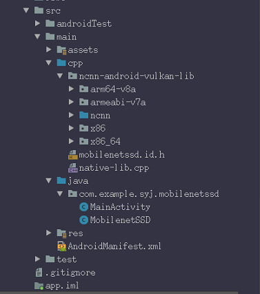
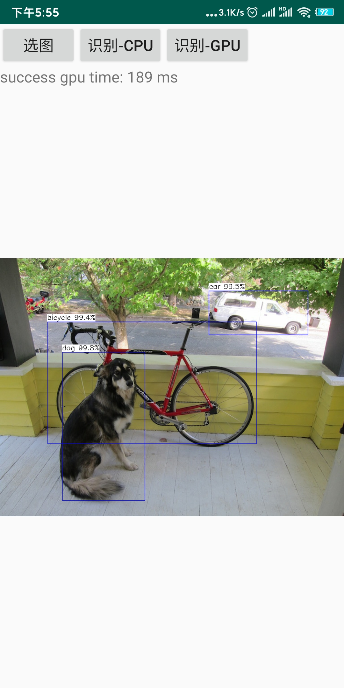

# MobilenetSSD_Android
using ncnn, on android,detection,surport **arm v7/v8/x86**, surport **vulkan** on gpu

## environment
[ncnn](https://github.com/Tencent/ncnn)  
AndroidStudio3.2(NDK19)  
Qualcomm845

## model
using pretrained **MobilenetSSD** on VOC，by[chuanqi305](https://github.com/chuanqi305/MobileNet-SSD),***mAP=0.72***   
notice：the model in ncnn/example/mobilenetssd is too old to perform，please use ncnn-assert  
**pipeline**:  model on **PC -->   ONNX  ---> model on ncnn(.bin,,param) --> inference on Android**  
converted model on ncnn is from [ncnn-assert](https://github.com/nihui/ncnn-assets)

## organization
using **ncnn** and **opencv** on android  
the sim-overall android-organization is here

## result
infer time on **845** in float32 is aroud ***100ms***, depending on the object  

**ncnn** is good in optimazing on float32

## apk
the apk is available on [BAaiduYun](https://pan.baidu.com/s/1smYlzeCaa8hcEwP3LRWn4w),password is **3alh**

## reference
(https://github.com/nihui/ncnn-android-squeezenet)  
(https://blog.csdn.net/qq_33431368/article/details/84990390)
